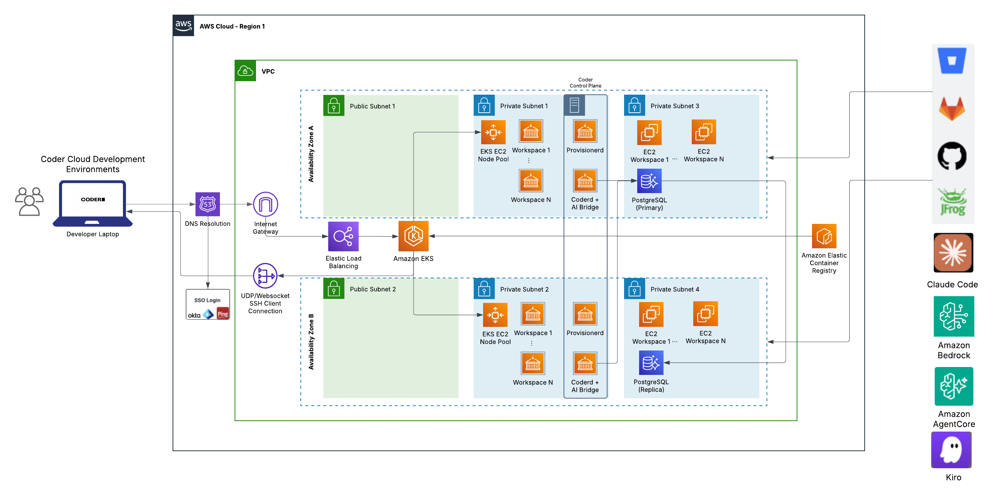

# AWS Coder AI-DLC GitOps

Enterprise-grade AI-powered development platform on AWS using Coder, Kubernetes, and integrated AI assistants (Claude Code and Kiro CLI).



## Overview

This repository provides infrastructure-as-code and Coder workspace templates for deploying a complete AI-assisted development environment on AWS. The platform combines Coder's cloud development environments with AI coding assistants, running on Amazon EKS with Aurora PostgreSQL backend.  See [Deployment Instructions](#deployment-instructions) to deploy into your own AWS Account.

## Architecture

The deployment creates:

- **Amazon EKS Cluster** (Auto Mode) with Kubernetes 1.35
- **Aurora PostgreSQL Serverless v2** for Coder database
- **CloudFront Distribution** for secure global access
- **Network Load Balancer** for EKS ingress
- **VPC with Public/Private Subnets** across 2 availability zones
- **NAT Gateways** for private subnet internet access
- **S3 Buckets** for CloudFront and NLB logging
- **Secrets Manager** for credential storage
- **IAM Roles** with least-privilege permissions

## Available Workspace Templates

### 1. Kubernetes with Kiro CLI (`awshp-k8s-base-kirocli`)

AI-powered development workspace with Kiro CLI integration.

**Features:**
- Kiro CLI for AI-assisted development
- Kiro IDE web interface
- code-server (VS Code in browser)
- AWS CLI v2 and AWS CDK pre-installed
- Node.js 20.x LTS
- Nirmata CLI (nctl)
- MCP server support (Pulumi, LaunchDarkly, Arize)
- Persistent home directory storage

**Default Resources:**
- CPU: 2 cores (configurable 2-8)
- Memory: 4 GB (configurable 4-16 GB)
- Storage: 30 GB (configurable 10-50 GB)

### 2. Kubernetes with Claude Code (`awshp-k8s-base-claudecode`)

Autonomous AI development workspace with Claude Code task automation.

**Features:**
- Claude Code AI assistant with task automation
- AWS Bedrock integration (Claude Opus 4.5)
- Kiro IDE web interface
- code-server (VS Code in browser)
- AWS CLI v2 and AWS CDK pre-installed
- Node.js 20.x LTS
- Nirmata CLI (nctl)
- MCP server support (Pulumi, LaunchDarkly, Arize)
- Preview server on port 3000
- Persistent home directory storage

**Default Resources:**
- CPU: 4 cores (configurable 2-8)
- Memory: 8 GB (configurable 4-16 GB)
- Storage: 30 GB (configurable 10-50 GB)

## Prerequisites

- AWS Account with appropriate permissions
- AWS CLI configured
- CloudFormation access
- Sufficient service quotas for:
  - EKS clusters
  - Aurora PostgreSQL
  - CloudFront distributions
  - VPC resources (NAT Gateways, Elastic IPs)

## Deployment Instructions

### Step 1: Deploy CloudFormation Stack

1. Navigate to AWS CloudFormation console in your desired region
2. Create a new stack using [`infrastructure/coder_deployment.yaml`](./infrastructure/coder_deployment.yaml)
3. Configure the following parameters:

**Required Parameters:**
- `CoderAdminEmail`: Administrator email address
- `CoderAdminUser`: Administrator username (default: `admin`)
- `CoderAdminPassword`: Administrator password (min 8 characters)
- `CoderAdminName`: Administrator full name

**Optional Parameters:**
- `EKSClusterName`: Name for EKS cluster (default: `coder-aws-cluster`)
- `KubernetesVersion`: Kubernetes version (default: `1.35`)
- `CoderVersion`: Coder version (default: `2.29.1`)
- `WorkerNodeInstanceType`: EC2 instance type (default: `t3.large`)
- `CoderPremiumTrial`: Start 30-day trial (default: `false`)
- `CoderGitOpsTemplateRepoURL`: Template repository URL
- `RetryFlag`: Rerun with existing EKS (default: `False`)

4. Acknowledge IAM resource creation
5. Create the stack

**Deployment Time:** Approximately 30-45 minutes

### Step 2: Monitor Deployment

The CloudFormation stack orchestrates:
1. VPC and networking setup
2. Aurora PostgreSQL cluster creation
3. EKS cluster provisioning (Auto Mode)
4. Coder installation via Helm
5. CloudFront distribution setup
6. GitOps template deployment

Monitor progress in:
- CloudFormation Events tab
- CodeBuild logs: `/aws/codebuild/CodeBuild-<StackName>`
- EKS cluster creation in EKS console

### Step 3: Retrieve Access Information

Once deployment completes, find these outputs in CloudFormation Outputs tab:

**Critical Outputs:**
- `CoderURL`: CloudFront URL for accessing Coder (e.g., `https://d1234567890.cloudfront.net`)
- `CoderAdminEmail`: Administrator email
- `CoderAdminPassword`: Administrator password
- `CoderAdminPasswordSecretArn`: Secrets Manager ARN for password
- `CoderSessionTokenSecretArn`: Secrets Manager ARN for API token
- `PostgreSQLConnectionURLWithoutPassword`: Database connection string
- `CloudFormationStack`: Stack name for reference

### Step 4: Access Coder

1. Open the `CoderURL` from CloudFormation outputs
2. Log in with:
   - Email: Value from `CoderAdminEmail` output
   - Password: Value from `CoderAdminPassword` output (or retrieve from Secrets Manager)

3. Create your first workspace:
   - Click "Create Workspace"
   - Select one of the available templates
   - Configure resources (CPU, memory, storage)
   - For Claude Code templates, provide an AI task prompt
   - Click "Create Workspace"

### Step 5: Configure MCP Servers (Optional)

For templates with MCP (Model Context Protocol) server support:

1. **Pulumi MCP Server:**
   - Obtain bearer token from [Pulumi](https://www.pulumi.com/)
   - Update template variable `mcp_bearer_token_pulumi`

2. **LaunchDarkly MCP Server:**
   - Obtain API key from [LaunchDarkly](https://launchdarkly.com/)
   - Update template variable `mcp_bearer_token_launchdarkly`

3. **Arize Tracing Assistant:**
   - Pre-configured via uvx, no additional setup required

## Infrastructure Components

### Networking
- **VPC CIDR:** 192.168.0.0/16
- **Public Subnets:** 192.168.0.0/19, 192.168.32.0/19
- **Private Subnets:** 192.168.96.0/19, 192.168.128.0/19
- **NAT Gateways:** 2 (one per AZ for high availability)
- **Internet Gateway:** Single IGW for public subnet access

### Security
- **Encryption at Rest:** KMS encryption for EKS secrets and Aurora
- **Encryption in Transit:** TLS via CloudFront and NLB
- **IAM Roles:** Least-privilege access for workspaces
- **Security Groups:** Restrictive rules for Aurora (port 5432 from VPC only)
- **Secrets Management:** AWS Secrets Manager for credentials

### Database
- **Engine:** Aurora PostgreSQL 16.6
- **Mode:** Serverless v2
- **Scaling:** 0.5 - 128 ACUs
- **Backup:** 3-day retention
- **Encryption:** Enabled with KMS

### Kubernetes
- **Mode:** EKS Auto Mode (managed node scaling)
- **Version:** 1.35
- **Add-ons:** aws-ebs-csi-driver for persistent volumes
- **Logging:** CloudWatch Logs for all log types
- **OIDC:** Enabled for IAM roles for service accounts
- **Storage Class:** gp3 EBS volumes for workspace persistence

### Observability
- **CloudWatch Logs:** EKS control plane and CodeBuild logs
- **S3 Logging:** CloudFront and NLB access logs
- **Log Retention:** 90 days

## GitOps Workflow

Templates are deployed using Terraform with the Coder provider:

1. **Template Source:** `templates/` directory
2. **Version Control:** Git SHA used for template versioning
3. **Deployment:** Automated via `templates_gitops.sh` during stack creation
4. **Updates:** Re-run script with new Git SHA to update templates

```bash
# Manual template update
cd templates/
export TF_VAR_coder_url="https://your-coder-url"
export TF_VAR_coder_token="your-session-token"
export TF_VAR_coder_gitsha="$(git log -1 --format=%H)"
terraform apply -auto-approve
```

## Workspace Permissions

Workspaces run with the `coder-and-aws-workshop-user` IAM role, providing access to:

- **Amazon Bedrock:** Full access for AI model inference
- **AWS Secrets Manager:** Create and manage secrets
- **AWS Lambda:** Create and manage functions
- **Amazon S3:** Full access for storage
- **AWS IAM:** Limited role and policy management
- **Amazon EKS:** Cluster operations
- **Amazon CloudFront:** Distribution management
- **Amazon EC2:** Instance and VPC operations
- **Amazon OpenSearch:** Serverless collections
- **Amazon DynamoDB:** Table operations
- **Amazon RDS:** Database operations
- **Amazon SageMaker:** Notebook and endpoint management
- **AWS CloudFormation:** Stack operations
- **Amazon CloudWatch Logs:** Log management
- **AWS KMS:** Key operations

**Restrictions:**
- Cannot modify AWS-managed or workshop-created roles
- Cannot delete OpenID Connect providers

## Troubleshooting

### Stack Creation Fails

1. Check CodeBuild logs: `/aws/codebuild/CodeBuild-<StackName>`
2. Verify service quotas for EKS, Aurora, CloudFront
3. Ensure IAM permissions are sufficient
4. Check for resource naming conflicts

### Cannot Access Coder URL

1. Verify CloudFront distribution status (must be "Deployed")
2. Check NLB target health in EC2 console
3. Verify Coder pod is running: `kubectl get pods -n coder`
4. Check security group rules allow traffic

### Workspace Creation Fails

1. Check EKS node capacity
2. Verify storage class exists: `kubectl get sc`
3. Check PVC creation: `kubectl get pvc -n coder`
4. Review workspace logs in Coder UI

### MCP Servers Not Working

1. Verify bearer tokens are correctly configured
2. Check workspace startup logs for MCP initialization
3. Ensure Node.js and npm are installed
4. For uvx-based servers, verify uv installation

## Cleanup

To delete all resources:

1. Delete all Coder workspaces from the UI
2. Delete the CloudFormation stack
3. Manually delete:
   - CloudFront distribution (if not auto-deleted)
   - S3 buckets (logging buckets)
   - EKS cluster (if not auto-deleted)
   - Aurora cluster (if not auto-deleted)

**Note:** Some resources may require manual deletion due to CloudFormation protection or dependencies.

## Cost Considerations

Estimated monthly costs (us-west-2, on-demand pricing):

- **EKS Cluster:** ~$73/month (control plane)
- **EC2 Instances:** Variable based on Auto Mode scaling
- **Aurora Serverless v2:** ~$43/month minimum (0.5 ACU)
- **NAT Gateways:** ~$65/month (2 gateways)
- **CloudFront:** Variable based on traffic
- **Data Transfer:** Variable based on usage

**Cost Optimization:**
- Use workspace auto-stop policies
- Scale down Aurora during off-hours
- Monitor and adjust EKS Auto Mode settings
- Review CloudWatch Logs retention

## Security Best Practices

1. **Rotate Credentials:** Regularly rotate Coder admin password and session tokens
2. **Enable MFA:** Configure MFA for AWS account and Coder users
3. **Review IAM Policies:** Audit workspace IAM role permissions
4. **Monitor Access:** Enable CloudTrail and review access logs
5. **Update Regularly:** Keep Coder, Kubernetes, and dependencies updated
6. **Network Segmentation:** Use security groups and NACLs appropriately
7. **Secrets Management:** Never commit secrets to Git; use Secrets Manager

## Support and Resources

- **Coder Documentation:** [https://coder.com/docs](https://coder.com/docs)
- **AWS EKS Documentation:** [https://docs.aws.amazon.com/eks/](https://docs.aws.amazon.com/eks/)
- **Kiro CLI Documentation:** [https://kiro.dev/docs](https://kiro.dev/docs)
- **Claude Code Documentation:** [https://coder.com/docs/claude-code](https://coder.com/docs/claude-code)

## License

See [LICENSE](LICENSE) file for details.

## Contributing

This repository is designed for AWS AI Builder Lab Events. For modifications or contributions, please follow standard GitOps practices and test changes in a non-production environment first.
